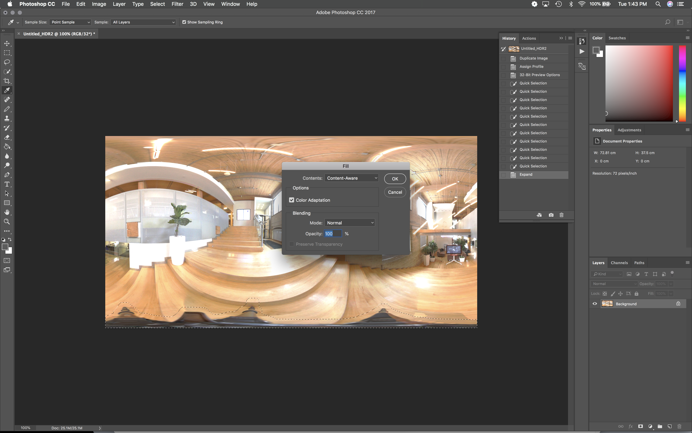
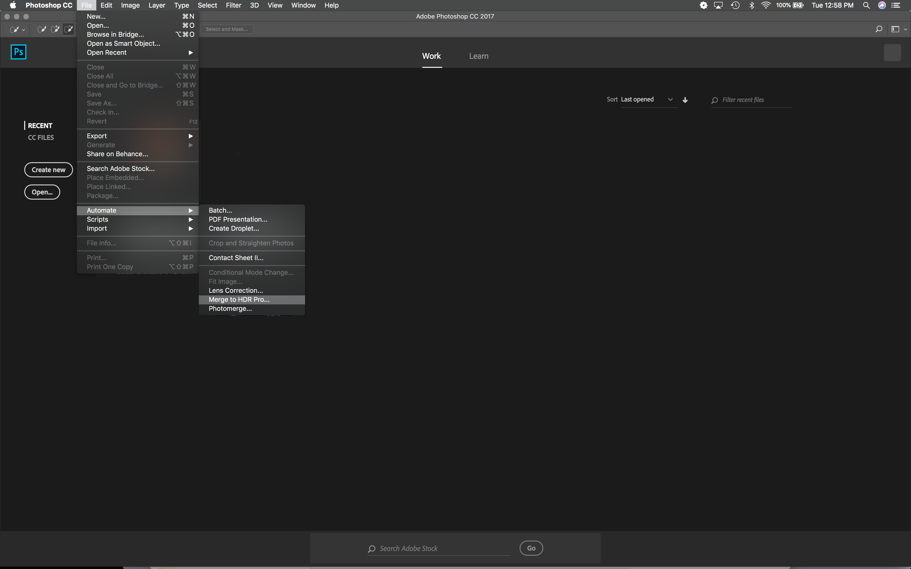
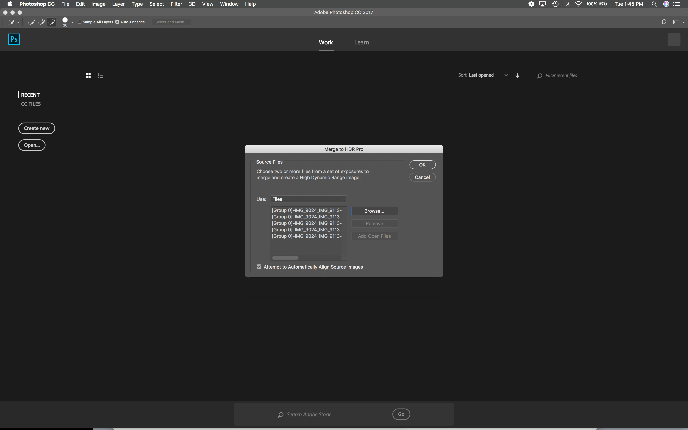
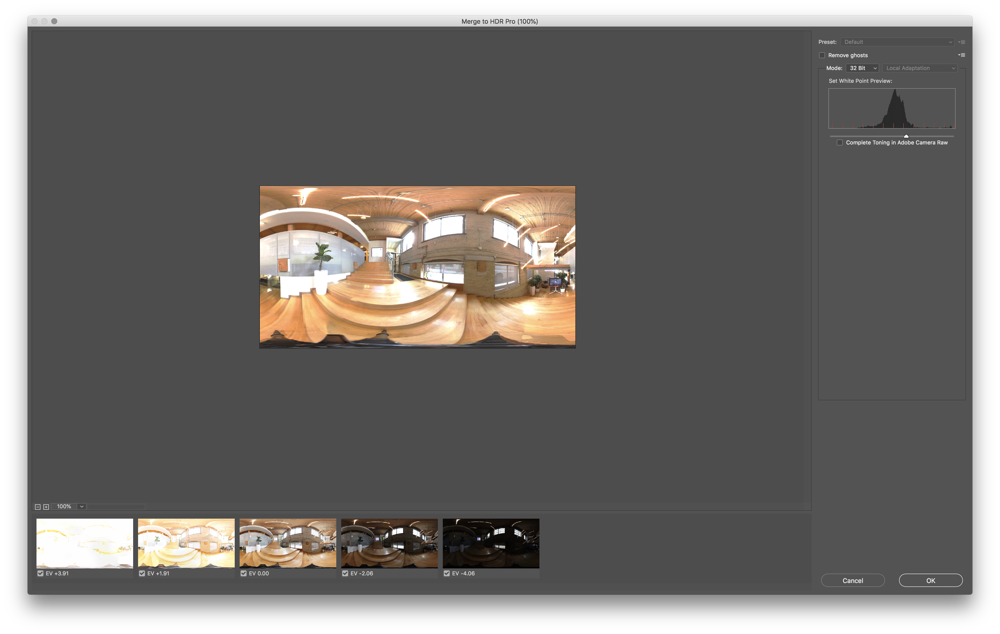

Introduction

In this guide we will go over a workflow for creating spherical HDR maps, suitable for use in an image based lighting based pipeline.

At a high level, there will be three steps:

1. Panoramic photography, using Magic Lantern and a fish eye lens
2. Aligning the photos using Autopano Pro
3. Merging the LDR panoramas into a final HDR (and removing the tripod) using Photoshop

Step 1. Panoramic photography

Take the photos, using 5 brackets, 3 elevation, 6 angles for a total of 90 photos.

Step 2. Aligning photos

Start Autopano Pro.

Open images

Setup groups

Export into 5 merged layers, but not yet HDR

Step 3. Creating final HDR

Open Photoshop

Merge to HDR Pro

Select the tripod using quick select

Expand the selection

Edit > Fill, Content Aware

