Introduction

In this guide we will go over a workflow for creating spherical HDR maps, suitable for use in an image based lighting based pipeline.

At a high level, there will be three steps:

1. Panoramic photography, using Magic Lantern and a fish eye lens
2. Aligning the photos using Autopano Pro
3. Merging the LDR panoramas into a final HDR (and removing the tripod) using Photoshop

Step 1. Panoramic photography

Take the photos, using 5 brackets, 3 elevation, 6 angles for a total of 90 photos.

# Step 2. Aligning photos

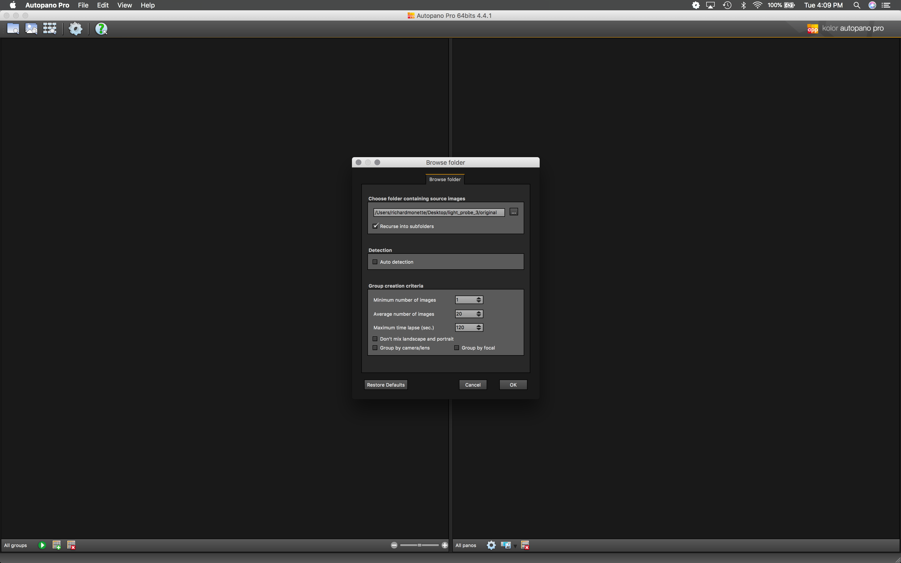

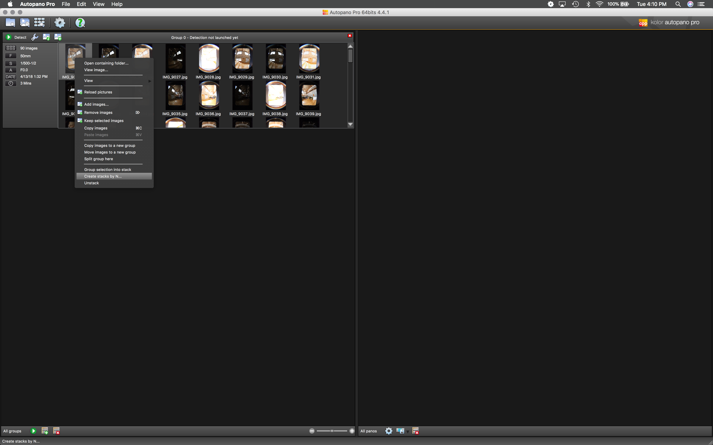

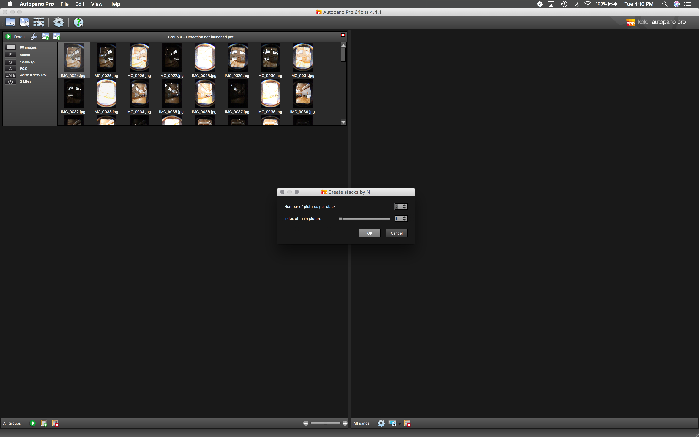

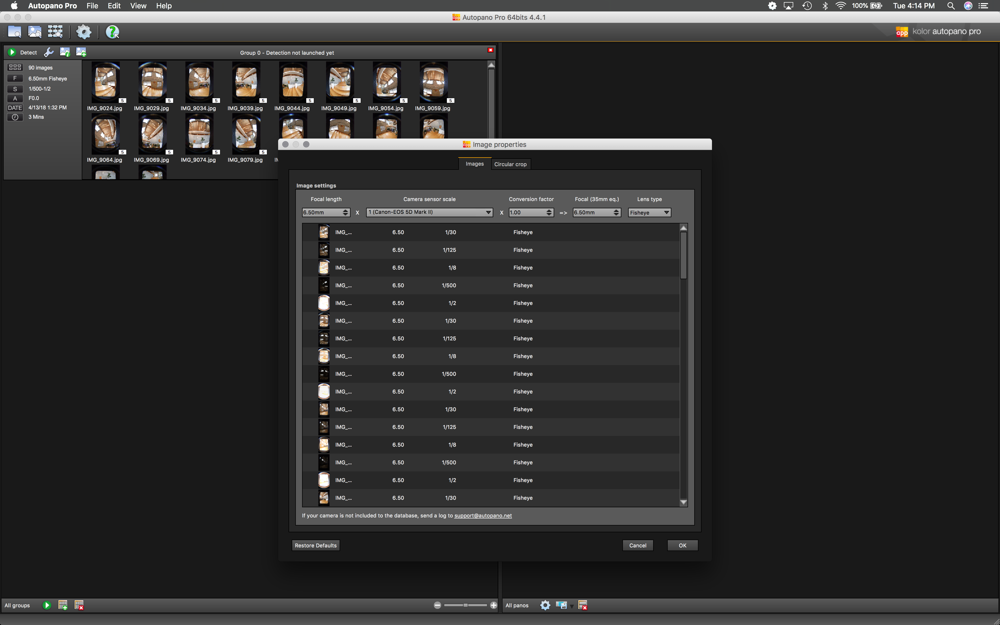

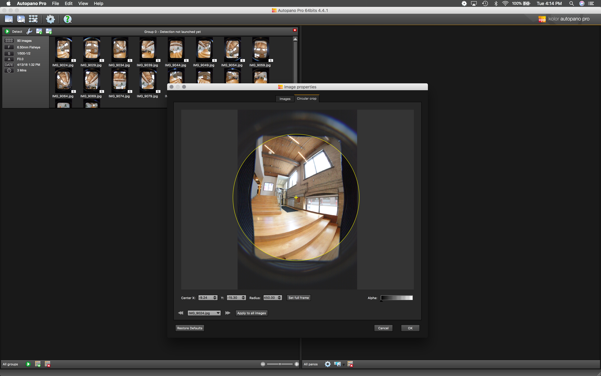

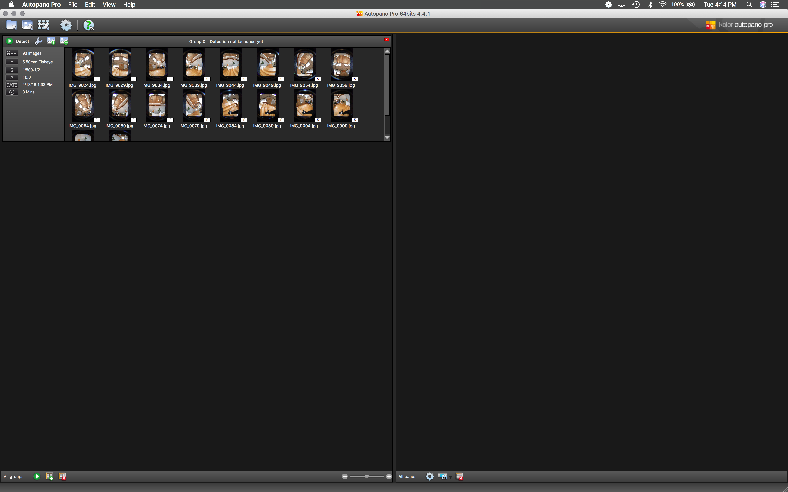

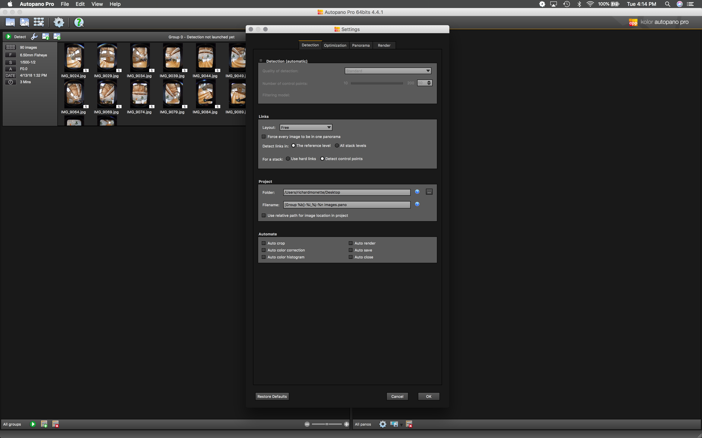

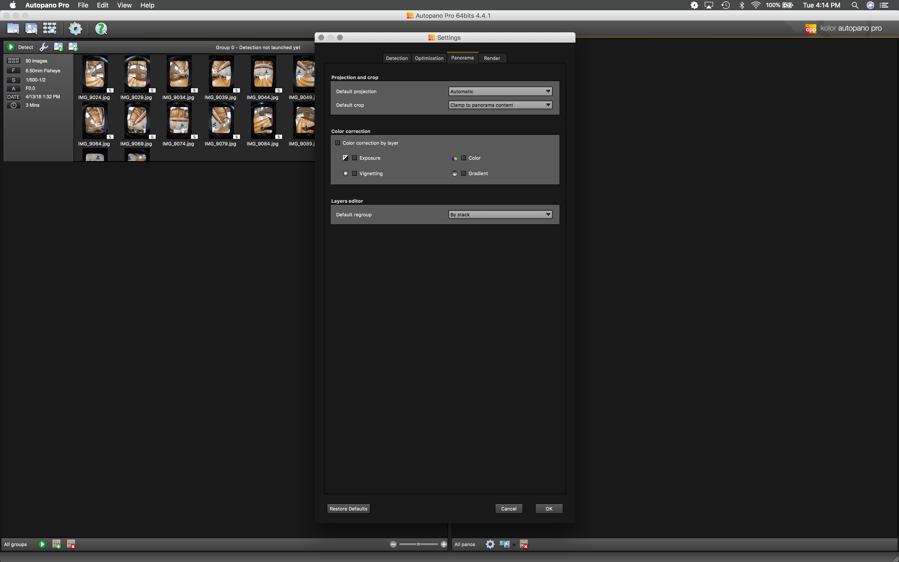

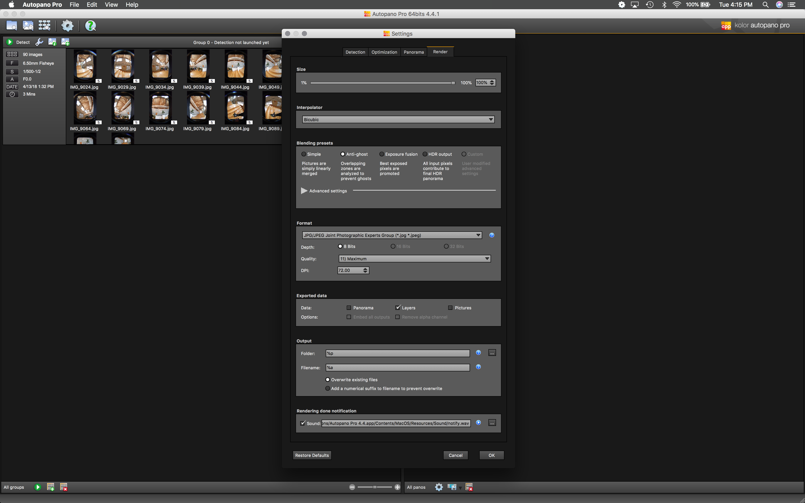

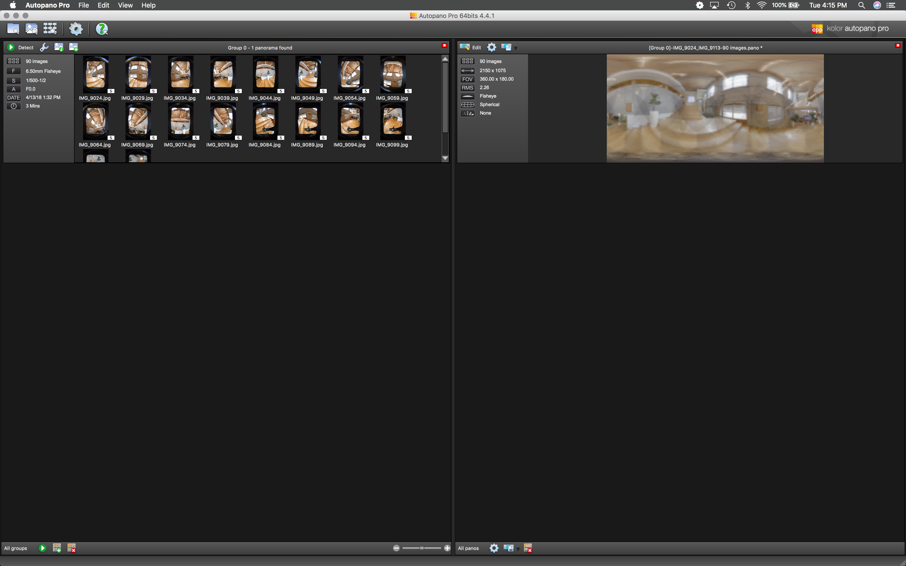

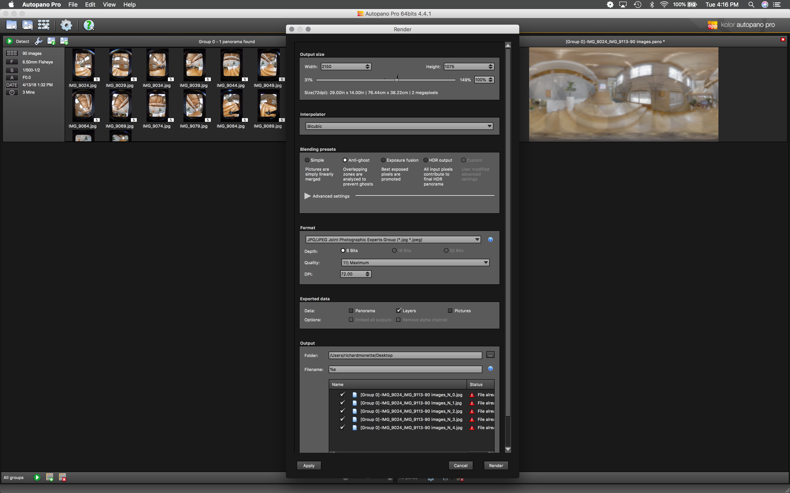

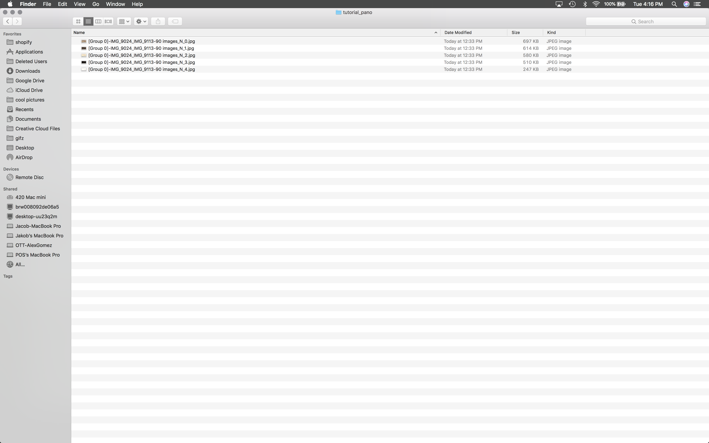

# Step 3. Creating final HDR

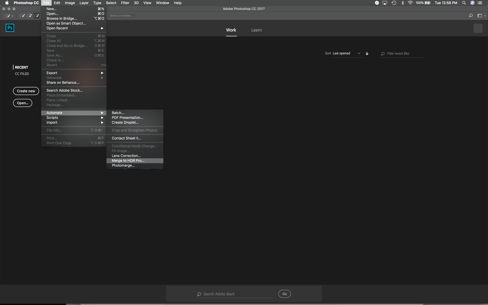

Now that we have our 5 exposure panoramas, we want to merge those together to create the single HDR panorama. To do this we will use the Merge to HDR option in Photoshop.

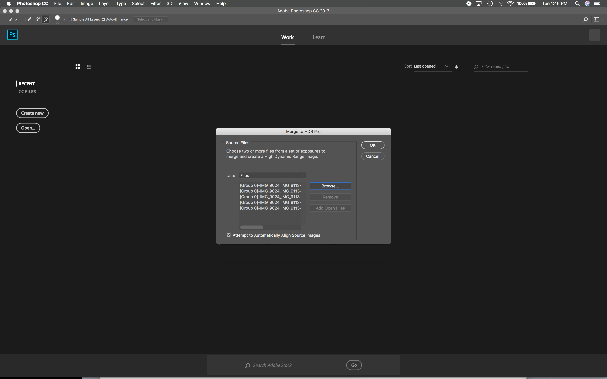

Select the 5 bracketed exposure panoramas.

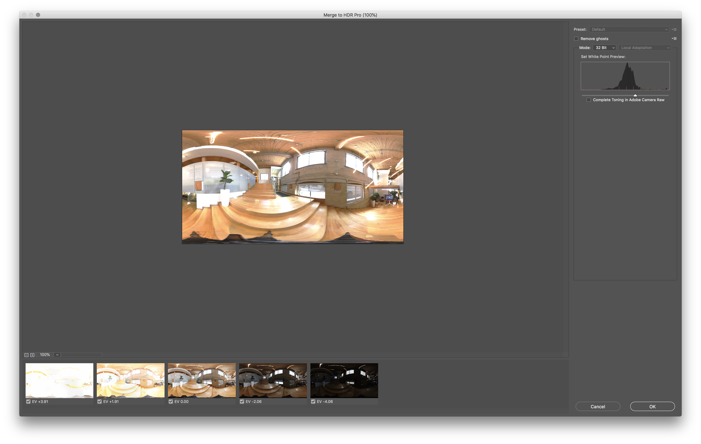

Here we can see the 5 exposures which are being combined into the single HDR panorama.

Our final step will be to remove the tripod from the panorama. Use the magic wand to select the tripod.

Expand the selection to get a bit of the surrounding, non tripod image data.

We will then use the Content Aware fill to eliminate the tripod.

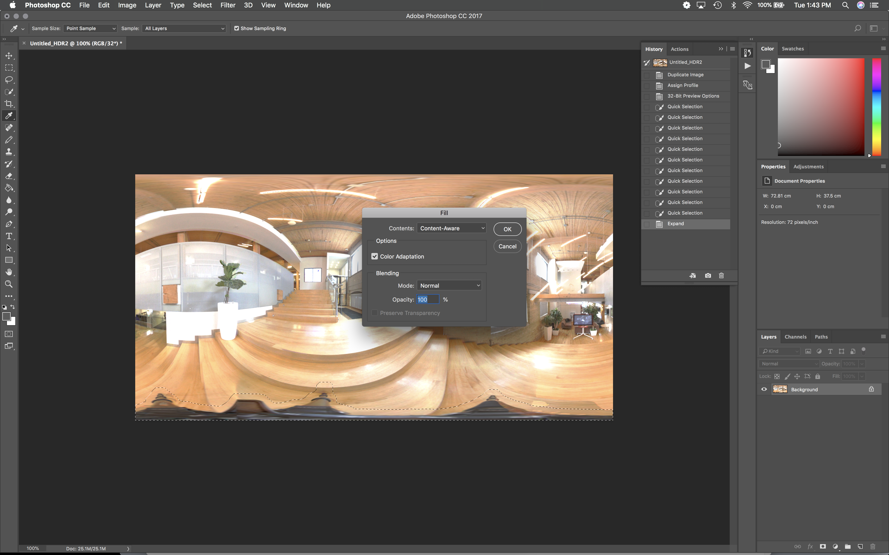

Finally, export the HDR panorama as an EXR.
